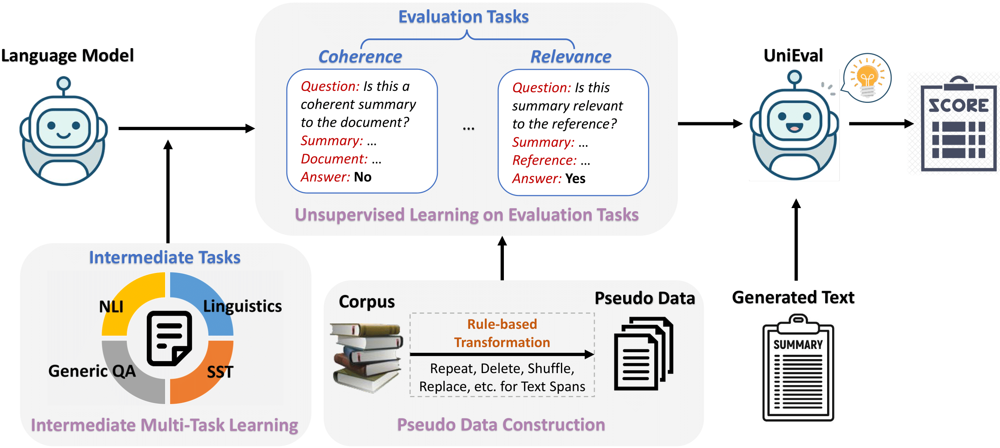

# UniEval

This repository maintains code, data and pre-trained evaluators for EMNLP 2022 paper

*[Towards a Unified Multi-Dimensional Evaluator for Text Generation](https://arxiv.org/abs/2210.07197)*

## Overview

**Multi-dimensional evaluation** is the dominant paradigm for human evaluation in Natural Language Generation (NLG), i.e., evaluating the generated text from multiple explainable dimensions, such as *coherence* and *fluency*.

However, automatic evaluation in NLG is still dominated by similarity-based metrics (e.g., ROUGE, BLEU), but they are not sufficient to portray the difference between the advanced generation models.

Therefore, we propose **UniEval** to bridge this gap so that a more comprehensive and fine-grained evaluation of NLG systems can be achieved.

## Method
<p align="center">
    
</p>

We convert all evaluation tasks of different dimensions into Boolean QA problems and utilize the model to answer with “Yes” or “No”.


This unified QA format allows the model to incorporate external knowledge from multiple related tasks, i.e., intermediate multi-task learning in the Figure. The code and data for intermediate pre-training can be found in the [intermediate_tasks](./intermediate_tasks) folder.

Then we construct pseudo data for each dimension and train them sequentially to obtain **UniEval**. Details about unsupervised learning on evaluation tasks can be found in the [evaluation_tasks](./evaluation_tasks) folder.


## Get Multi-Dimenisonal Scores

### Environment
```
git clone https://github.com/maszhongming/UniEval.git
cd UniEval
pip install -r requirements.txt
```

### Pre-trained Evaluators
We release four pre-trained evaluators for different NLG tasks as follows:

- [unieval-sum](https://huggingface.co/MingZhong/unieval-sum) evaluates *coherence*, *consistency*, *fluency* and *relevance* for text summarization. It can also used to evaluate *naturalness* and *informativeness* for data-to-text.
- [unieval-dialog](https://huggingface.co/MingZhong/unieval-dialog) evaluates *naturalness*, *coherence*, *engagingness*, *groundedness* and *understandability* for dialogue response generation.
- [unieval-fact](https://huggingface.co/MingZhong/unieval-fact) is specifically used to evaluate factual consistency.
- [unieval-intermediate](https://huggingface.co/MingZhong/unieval-intermediate) is obtained after intermediate pre-training. It can be viewed as a Boolean answer generator.

### Get Scores for Summarization
Example usage for summarization is shown below.
```python
from utils import convert_to_json
from metric.evaluator import get_evaluator

task = 'summarization'

# a list of source documents
src_list = ['Peter and Elizabeth took a taxi to attend the night party in the city. \
             While in the party, Elizabeth collapsed and was rushed to the hospital.']
# a list of human-annotated reference summaries
ref_list = ['Elizabeth was hospitalized after attending a party with Peter.']
# a list of model outputs to be evaluataed
output_list = ['Peter and Elizabeth attend party city. Elizabeth rushed hospital.']

# Prepare data for pre-trained evaluators
data = convert_to_json(output_list=output_list, 
                       src_list=src_list, ref_list=ref_list)
# Initialize evaluator for a specific task
evaluator = get_evaluator(task)
# Get multi-dimensional evaluation scores
eval_scores = evaluator.evaluate(data, print_result=True)
```
eval_scores contains the scores of all dimensions for each sample. The printed average scores should look like:
```
+-------------+----------+
|  Dimensions |  Score   |
+-------------+----------+
|  coherence  | 0.948185 |
| consistency | 0.883036 |
|   fluency   | 0.42928  |
|  relevance  | 0.636075 |
|   overall   | 0.724144 |
+-------------+----------+
```
Overall score here can be customized as a combination of scores based on different dimensions. The default is the average score of all dimensions.

Notably, because the different dimensions have different focuses, they usually require different content as input. For summarization, the inputs when evaluating the four dimensions are as follows:

- *coherence*: output_list, src_list
- *consistency*: output_list, src_list
- *fluency*: output_list
- *relevance*: output_list, ref_list

Therefore, **UniEval** is a reference-free evaluator in all dimensions except *relevance*. So it is also possible to evaluate the generated summaries without reference as:

```python
eval_scores = evaluator.evaluate(data, dims=['coherence', 'consistency', 'fluency'], 
                                 overall=False, print_result=True)
```

### Get Scores for Dialogue
Example usage for dialogue response generation is shown below.
```python
from utils import convert_to_json
from metric.evaluator import get_evaluator

task = 'dialogue'

# a list of dialogue histories
src_list = ['hi , do you know much about the internet ? \n i know a lot about different sites and some website design , how about you ? \n\n']
# a list of additional context that should be included into the generated response
context_list = ['the 3 horizontal line menu on apps and websites is called a hamburger button .\n']
# a list of model outputs to be evaluated
output_list = ['i do too . did you know the 3 horizontal line menu on apps and websites is called the hamburger button ?']

# Prepare data for pre-trained evaluators
data = convert_to_json(output_list=output_list, 
                       src_list=src_list, context_list=context_list)
# Initialize evaluator for a specific task
evaluator = get_evaluator(task)
# Get multi-dimensional evaluation scores
eval_scores = evaluator.evaluate(data, print_result=True)
```
The results should be:
```
+-------------------+----------+
|     Dimensions    |  Score   |
+-------------------+----------+
|    naturalness    | 0.950218 |
|     coherence     | 0.973135 |
|    engagingness   | 1.750486 |
|    groundedness   | 0.999566 |
| understandability | 0.946209 |
|      overall      | 1.123923 |
+-------------------+----------+
```
*engagingness* is the only dimension that uses summation scores, as it indicates the total volume of interesting fact presented in the response. Therefore, the scoring range for *engagingness* is [0, +∞), while all others are [0, 1].

Please keep the format of the input dialogue consistent with [topical_chat.json](./reproduce/data/dialogue/topical_chat.json), i.e. use `\n` to separate the different turns in the dialogue history and end it with `\n\n`. In addition, each context also ends with `\n`.

**UniEval** is a reference-free evaluator for dialogue response generation. The input content for each dimension is:

- *naturalness*: output_list
- *coherence*: output_list, src_list
- *engagingness*: output_list, src_list, context_list
- *groundedness*: output_list, context_list
- *understandability*: output_list

### Get Factual Consistency Score
**UniEval** can also act as a high-performance single-dimensional evaluator, such as achieving the best correlation when evaluating factual consistency (see Tables 3 and 9 in the paper). Example usage for factual consistency detection is shown below.
```python
from utils import convert_to_json
from metric.evaluator import get_evaluator

task = 'fact'

# a list of source documents
src_list = ['Peter and Elizabeth took a taxi to attend the night party in the city. \
             While in the party, Elizabeth collapsed and was rushed to the hospital.']
# a list of model outputs (claims) to be evaluataed
output_list = ['Tom was rushed to hospital.']

# Prepare data for pre-trained evaluators
data = convert_to_json(output_list=output_list, src_list=src_list)
# Initialize evaluator for a specific task
evaluator = get_evaluator(task)
# Get factual consistency scores
eval_scores = evaluator.evaluate(data, print_result=True)
```
The results only include one dimension:
```
+-------------+----------+
|  Dimensions |  Score   |
+-------------+----------+
| consistency | 0.025441 |
+-------------+----------+
```

### Transfer to Other NLG Tasks
**UniEval** also demonstrates the ability to transfer to new NLG tasks. We provide instructions for two scenarios:

1. Transfer to other dimensions

(a) If the new dimension is close to one of UniEval's existing dimensions, you can directly evaluate it with the corresponding evaluator and specify the desired dimension.

(b) If the new dimension requires a different input or question description, please modify the `add_question` function in [utils.py](./utils.py) and select an evaluator of a similar task for evaluation.

2. Transfer to other generation tasks

We take the data-to-text task as an example to show how to transfer UniEval to an unseen task.

(1) Create a task-specific evaluator in [metric/evaluator.py](./metric/evaluator.py), initializing it by specifying the pre-trained evaluator used and the dimensions to be evaluated. All required content should be inputted in the `self.evaluate()` function. Details can refer to `D2tEvaluator` in [metric/evaluator.py](./metric/evaluator.py).

(2) Specify the required content and a specific question description for each dimension in `add_question`. They form the input to the evaluator. The input format for evaluating *naturalness* and *informativeness* in the data-to-text task can be found in [utils.py](./utils.py).

(3) As in [examples.py](./examples.py), multi-dimensional evaluation scores can be obtained.


## Reproduce

To reproduce all the results in the paper, we provide all meta-evaluation datasets, codes, and evaluation scores predicted by **UniEval** in the folder [reproduce](./reproduce).


