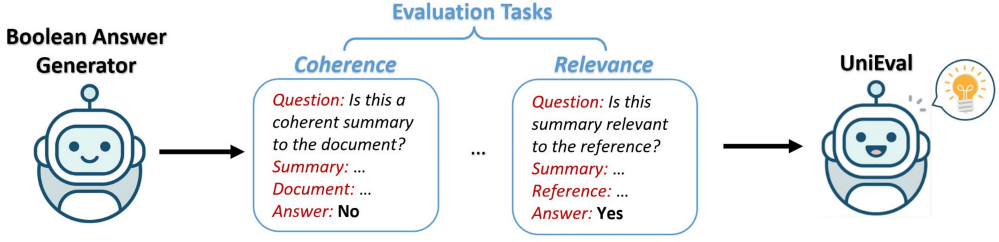

# Unsupervised Learning on Evaluation Tasks

<p align="center">
    
</p>

Based on the Boolean Answer Generator, we then construct pseudo data for each dimension and train them sequentially to obtain UniEval.

## Pseudo Data
All the pseudo data for summarization and dialogue response generation can be found [here](https://drive.google.com/file/d/1SHsPPNvEAFNQToCdAFLhPulvQ6jEHdA5/view?usp=sharing). Please unzip it and put it in `./data`.

## Training
We use two strategies to train UniEval: Multi-task Learning and Continual Learning.

### Multi-task Learning
Run the following script to conduct multi-task learning:
```bash
export TOKENIZERS_PARALLELISM=true
export OMP_NUM_THREADS=1

CUDA_VISIBLE_DEVICES=0,1 \
python -m torch.distributed.launch --nproc_per_node 2 train_seq2seq.py \
    --model_name_or_path MingZhong/unieval-intermediate \
    --do_train \
    --train_file data/summarization/train_all.json \
    --text_column src \
    --summary_column tgt \
    --output_dir ./multitask_summ \
    --per_device_train_batch_size 3 \
    --gradient_accumulation_steps 6 \
    --max_source_length 1024 \
    --max_target_length 16 \
    --save_strategy steps \
    --save_steps 2000 \
    --num_train_epochs 3 \
    --ddp_find_unused_parameters False \
```

### Continual Learning
Run the following script to perform continual learning:
```bash
export TOKENIZERS_PARALLELISM=true
export OMP_NUM_THREADS=1

CUDA_VISIBLE_DEVICES=0,1 \
python -m torch.distributed.launch --nproc_per_node 2 train_seq2seq.py \
    --model_name_or_path MingZhong/unieval-intermediate \
    --do_train \
    --train_file data/summarization/coherence_3w.json \
    --text_column src \
    --summary_column tgt \
    --output_dir ./continual_summ_coherence \
    --per_device_train_batch_size 3 \
    --gradient_accumulation_steps 6 \
    --max_source_length 1024 \
    --max_target_length 16 \
    --save_strategy steps \
    --save_steps 500 \
    --num_train_epochs 3 \
    --ddp_find_unused_parameters False \

```
- After training on *coherence*, we need to continue training for *fluency* based on the obtained checkpoint. In this case, the input data are randomly sampled 20% `coherence_3w.json` (replay data) and 100% `fluency_3w.json`.
- Repeating the above process and training the four dimensions sequentially, we can finally obtain the evaluator for summarization.
- Training order for summarization: *coherence* → *fluency* → *consistency* → *relevance*
- Training order for dialogue response generation: *coherence* → *naturalness* → *groundedness* → *engagingness*