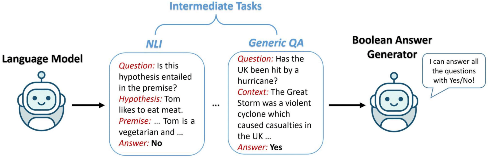

# Intermediate Pre-training

<p align="center">
    
</p>

By performing intermediate multi-task learning on T5, we can obtain a Boolean Answer Generator. We have released our intermediate model and based on [unieval-intermediate](https://huggingface.co/MingZhong/unieval-intermediate), you can train a custom evaluator for a specific NLG task.

## Pre-train Data

In total, we use data from the following four tasks to perform intermediate multi-task learning:

- Question Answering: [BoolQ](https://github.com/google-research-datasets/boolean-questions), [BoolQ-NP](https://github.com/allenai/natural-perturbations), [BoolQ-CS](https://github.com/allenai/contrast-sets), [StrategyQA](https://allenai.org/data/strategyqa) and [MultiRC](https://cogcomp.seas.upenn.edu/multirc/).
- Natural Language Inference: [DocNLI](https://arxiv.org/abs/2106.09449), [MRPC](https://huggingface.co/datasets/glue/viewer/mrpc/train) and [QQP](https://huggingface.co/datasets/glue/viewer/qqp/train)
- Self-supervised Task: Opening Sentence Prediction on [CNN/DailyMail Corpus](https://huggingface.co/datasets/cnn_dailymail)
- Linguistics-Related Task: [CoLA](https://huggingface.co/datasets/glue/viewer/cola/train)

The statistics are in [data_info.txt](./data_info.txt). All the pre-train data in the Boolean QA format can be found [here](https://drive.google.com/file/d/16T2tlAZDrgA5LMa5WYRhMz7SrAFwQfH7/view?usp=sharing). Please unzip it and put it in `./data`.

## Training
Run the following script to perform intermediate pre-training:
```bash
export TOKENIZERS_PARALLELISM=true
export OMP_NUM_THREADS=1

CUDA_VISIBLE_DEVICES=0,1,2 \
python -m torch.distributed.launch --nproc_per_node 3 train_seq2seq.py \
    --model_name_or_path google/t5-v1_1-large \
    --do_train \
    --train_file data/intermediate_train.json \
    --text_column src \
    --summary_column tgt \
    --output_dir ./inter_model \
    --per_device_train_batch_size 3 \
    --gradient_accumulation_steps 4 \
    --max_source_length 1024 \
    --max_target_length 16 \
    --save_strategy epoch \
    --num_train_epochs 10 \
    --ddp_find_unused_parameters False \
```

- The batch size can be determined based on your GPUs.
- We use the checkpoint of the second epochs as [unieval-intermediate](https://huggingface.co/MingZhong/unieval-intermediate).